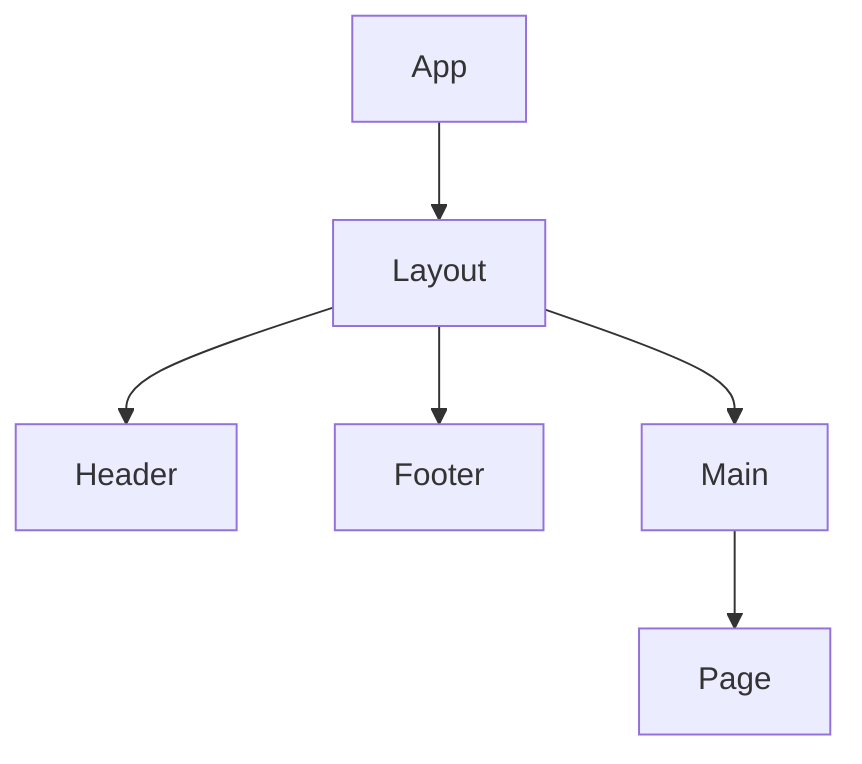

# COMPONENT.md テンプレート

---

# コンポーネント設計

## 1. コンポーネント一覧

| コンポーネント名 | 種別 | 説明 |
|-----------------|------|------|
| Button | ui | 汎用ボタン |
| Header | layout | ヘッダー |

## 2. コンポーネント階層図

## 3. 主要コンポーネント詳細

### Button
- Props: `variant`, `size`, `disabled`, `onClick`
- 用途: 汎用的なボタン

### Header
- Props: なし
- 用途: 全ページ共通ヘッダー
