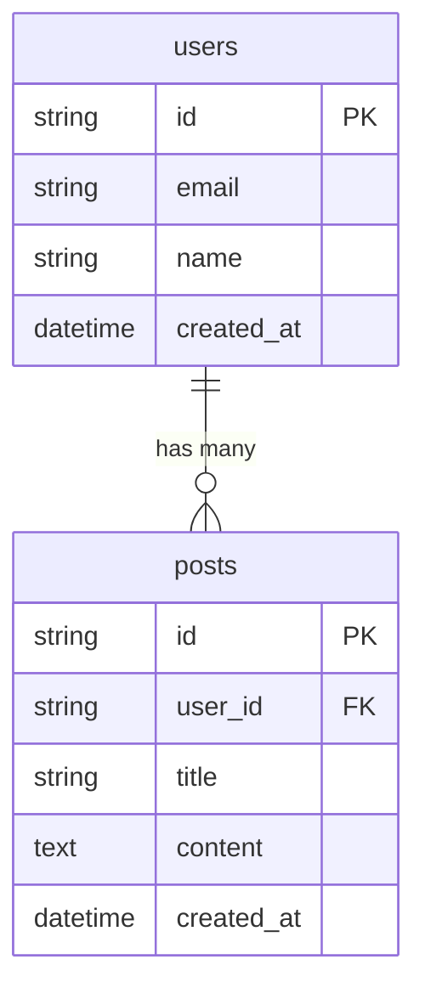

# DATA_MODEL.md テンプレート

> **SSOT**: DATA_MODEL.md はデータモデルの単一の情報源です

---

# データモデル

> このファイルがデータ構造の正式な定義です。
> 実装時はこのファイルを参照してください。

## 1. テーブル一覧

| テーブル名 | 説明         |
| ---------- | ------------ |
| users      | ユーザー情報 |
| posts      | 投稿情報     |

## 2. ER図

## 3. テーブル詳細

### users

| カラム     | 型          | NULL | デフォルト        | 説明                   |
| ---------- | ----------- | ---- | ----------------- | ---------------------- |
| id         | uuid        | NO   | gen_random_uuid() | 主キー                 |
| email      | text        | NO   | -                 | メールアドレス（一意） |
| name       | text        | NO   | -                 | ユーザー名             |
| created_at | timestamptz | NO   | now()             | 作成日時               |

**バリデーション:**

- email: メール形式
- name: 1-50文字

### posts

| カラム     | 型          | NULL | デフォルト        | 説明                 |
| ---------- | ----------- | ---- | ----------------- | -------------------- |
| id         | uuid        | NO   | gen_random_uuid() | 主キー               |
| user_id    | uuid        | NO   | -                 | 外部キー（users.id） |
| title      | text        | NO   | -                 | タイトル             |
| content    | text        | YES  | -                 | 本文                 |
| created_at | timestamptz | NO   | now()             | 作成日時             |

**バリデーション:**

- title: 1-100文字

## 4. RLS（Row Level Security）ポリシー

### users

- SELECT: 認証ユーザーは自分のデータのみ
- UPDATE: 認証ユーザーは自分のデータのみ

### posts

- SELECT: 全員が閲覧可能
- INSERT: 認証ユーザーのみ
- UPDATE/DELETE: 投稿者のみ
