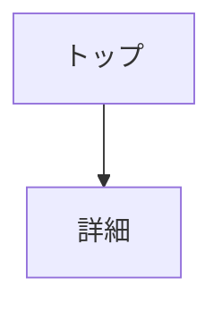

# SCREEN.md テンプレート

---

# 画面設計

## 1. 画面一覧

| 画面名 | パス | 説明 |
| ------ | ---- | ---- |
| トップ | /    | xxx  |

## 2. 画面遷移図

```mermaid
flowchart TB
    A[トップ] --> B[詳細]
```

## 3. 各画面詳細

### トップ画面（/）

- 要素一覧
- 挙動
