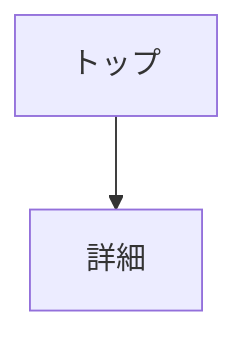
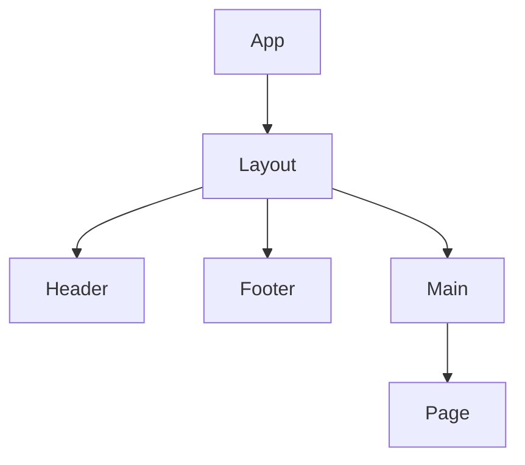
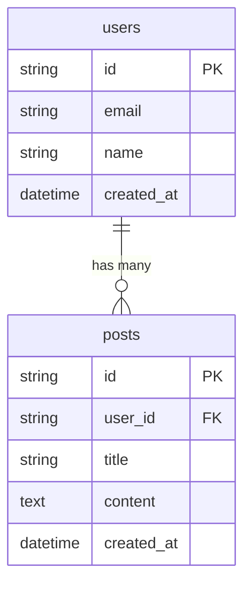

# CLAUDE.md

このファイルは Claude Code への指示書です。
プロジェクトで作業する際は、必ずこのファイルに従ってください。

---

## 1. プロジェクト概要

作業開始時に以下を確認：

| ファイル | 存在する場合 | 存在しない場合 |
|----------|-------------|---------------|
| docs/PRD.md | 内容を把握 | `/project:requirements` を促す |
| docs/DESIGN.md | 内容を把握 | `/project:design` を促す |
| docs/openapi.yaml | 内容を把握 | 必要に応じて作成 |
| src/ | 実装を継続 | 初回実装時に環境構築 |

---

## 2. 技術スタック

### 必須
| カテゴリ | 技術 |
|----------|------|
| フレームワーク | Next.js (App Router) 16.x |
| 言語 | TypeScript 5.x |
| スタイリング | Tailwind CSS 4.x |
| バリデーション | Zod |
| Linter / Formatter | ESLint / Prettier |
| パッケージ管理 | npm |
| Node.js | 24.x |
| 単体テスト | Vitest + React Testing Library |
| E2Eテスト | Playwright |
| コンポーネント管理 | Storybook |

### プロジェクトに応じて追加
| カテゴリ | 選択肢 |
|----------|--------|
| UIコンポーネント | shadcn/ui |
| アイコン | Lucide |
| フォーム | React Hook Form |
| データフェッチ | SWR / TanStack Query |

---

## 3. コマンド一覧

以下のスラッシュコマンドが使用可能です：

| コマンド | 説明 |
|----------|------|
| `/project:requirements` | 要件定義を行う |
| `/project:design` | 設計を行う |
| `/project:api` | API設計を行う |
| `/project:setup` | 環境構築を行う |
| `/project:prototype` | プロトタイプ実装（デザインコンセプト確定） |
| `/project:implement` | 本実装を行う |
| `/project:continue` | 進捗確認・作業再開 |
| `/project:review` | コードレビューと修正 |
| `/project:deploy` | デプロイを行う |

詳細は `.claude/commands/` 配下の各ファイルを参照。

---

## 4. 環境構築手順

`/project:setup` で src/ が存在しない場合に実行：

### 4.1 Next.js プロジェクト作成

既存ファイル（docs/PRD.md 等）がある場合、`create-next-app` は直接実行できないため、一時ディレクトリを経由する：

```bash
# 1. 一時ディレクトリで Next.js プロジェクトを作成
npx create-next-app@latest .nextjs-temp --yes

# 2. 生成されたファイルを現在のディレクトリにコピー（既存ファイルは上書きしない）
cp -rn .nextjs-temp/* .nextjs-temp/.[!.]* . 2>/dev/null || true

# 3. 一時ディレクトリを削除
rm -rf .nextjs-temp
```

※ `--yes` でデフォルト設定（TypeScript, Tailwind CSS, ESLint, App Router, Turbopack）が適用されます
※ `-n` オプションで既存ファイル（CLAUDE.md, docs/ 等）は保持されます

### 4.2 追加パッケージのインストール
```bash
# Formatter
npm install -D prettier eslint-config-prettier

# バリデーション
npm install zod

# テスト
npm install -D vitest @vitejs/plugin-react @testing-library/react @testing-library/jest-dom jsdom
npm install -D @playwright/test

# Storybook
npx storybook@latest init
```

### 4.3 設定ファイル作成

**.prettierrc**
```json
{
  "semi": false,
  "singleQuote": true,
  "tabWidth": 2,
  "trailingComma": "es5"
}
```

**.node-version**
```
24
```

**vitest.config.ts**
```typescript
import { defineConfig } from 'vitest/config'
import react from '@vitejs/plugin-react'
import path from 'path'

export default defineConfig({
  plugins: [react()],
  test: {
    environment: 'jsdom',
    setupFiles: ['./src/test/setup.ts'],
    globals: true,
  },
  resolve: {
    alias: {
      '@': path.resolve(__dirname, './src'),
    },
  },
})
```

**src/test/setup.ts**
```typescript
import '@testing-library/jest-dom'
```

**playwright.config.ts**
```typescript
import { defineConfig, devices } from '@playwright/test'

export default defineConfig({
  testDir: './e2e',
  fullyParallel: true,
  forbidOnly: !!process.env.CI,
  retries: process.env.CI ? 2 : 0,
  workers: process.env.CI ? 1 : undefined,
  reporter: 'html',
  use: {
    baseURL: 'http://localhost:3000',
    trace: 'on-first-retry',
  },
  projects: [
    {
      name: 'chromium',
      use: { ...devices['Desktop Chrome'] },
    },
  ],
  webServer: {
    command: 'npm run dev',
    url: 'http://localhost:3000',
    reuseExistingServer: !process.env.CI,
  },
})
```

### 4.4 npm scripts 追加
package.json の scripts に以下を追加：
```json
{
  "scripts": {
    "format": "prettier --write .",
    "test": "vitest",
    "test:e2e": "playwright test",
    "docs:api": "npx @redocly/cli preview-docs docs/openapi.yaml"
  }
}
```

### 4.5 GitHub Actions 追加
`.github/workflows/ci.yml` を作成：
```yaml
name: CI

on:
  push:
    branches: [main, develop]
  pull_request:
    branches: [main, develop]

jobs:
  ci:
    runs-on: ubuntu-latest
    steps:
      - uses: actions/checkout@v4

      - name: Setup Node.js
        uses: actions/setup-node@v4
        with:
          node-version: '24'
          cache: 'npm'

      - name: Install dependencies
        run: npm ci

      - name: Lint
        run: npm run lint

      - name: Test
        run: npm run test -- --run

      - name: Build
        run: npm run build
```

### 4.6 Analytics 設定
Vercel Analytics をデフォルトで導入：

```bash
npm install @vercel/analytics
```

`src/app/layout.tsx` に追加：
```typescript
import { Analytics } from '@vercel/analytics/react'

export default function RootLayout({ children }) {
  return (
    <html>
      <body>
        {children}
        <Analytics />
      </body>
    </html>
  )
}
```

#### ユーザー設定が必要な項目
| 項目 | 設定場所 | 説明 |
|------|----------|------|
| Vercel Analytics | Vercel ダッシュボード | Project Settings → Analytics → Enable |
| Google Analytics（任意） | `.env.local` | `NEXT_PUBLIC_GA_ID=G-XXXXXXXXXX` |

※ Google Analytics を追加する場合は別途 `@next/third-parties` を使用

---

## 5. ディレクトリ構成

```
├── src/
│   ├── app/              # ページ（App Router）
│   ├── components/       # UIコンポーネント
│   │   └── ui/           # 汎用部品
│   │       └── Button/
│   │           ├── Button.tsx
│   │           ├── Button.test.tsx
│   │           └── Button.stories.tsx
│   ├── hooks/            # カスタムフック
│   ├── lib/              # ユーティリティ関数
│   ├── types/            # 型定義
│   └── styles/           # グローバルCSS
├── .storybook/           # Storybook 設定
└── docs/                 # ドキュメント
```

### コロケーションルール
- コンポーネント、テスト、stories は同じディレクトリに配置
- `ComponentName/` フォルダでグループ化

---

## 6. 命名規則

| 対象 | 規則 | 例 |
|------|------|-----|
| コンポーネント | PascalCase | `Button.tsx` |
| フック | camelCase + use | `useSettings.ts` |
| ユーティリティ | camelCase | `formatDate.ts` |
| 型定義 | PascalCase | `Settings.ts` |
| 定数 | UPPER_SNAKE_CASE | `API_BASE_URL` |

---

## 7. コーディング規約

### 基本ルール
- 関数コンポーネントを使用（クラスコンポーネント禁止）
- `any` 型は禁止、必ず型を定義する
- コンポーネントは1ファイル1コンポーネント
- named export を基本（default export は app/ 配下のみ）

### インポート順序
1. 外部ライブラリ（react, next など）
2. 内部モジュール（@/ エイリアス）
3. 相対パス
4. 型定義

### コーディングスタイル
- async/await を使用（.then チェーン禁止）
- 早期リターンでネストを減らす
- マジックナンバーは定数化
- コメントは「なぜ」を書く（「何」はコードで表現）

---

## 8. 作業履歴ルール

**すべての作業は reports/WORK_LOG.md に記録すること。**

### 必須記録タイミング
1. **コマンド実行時**: 各 `/project:*` コマンド完了時に必ず記録
2. **チャット対応時**: ユーザー要望でファイルを変更した場合に記録

### 記録を忘れやすいケース（注意）
- 設計フェーズで複数ドキュメントを作成した後
- プロトタイプでコンポーネントを追加した後
- チャットでの細かい修正対応

### フォーマット
- 日付見出し（## YYYY-MM-DD）は同日なら再利用
- 新しい履歴はファイル上部に追記
- 詳細はセクション10「ドキュメントテンプレート」を参照

---

## 9. 禁止事項

- `any` 型の使用
- `console.log` の本番コード残留
- 未使用のインポート・変数
- `.then` チェーン（async/await を使う）
- クラスコンポーネント
- インラインスタイル（Tailwind を使う）
- default export（app/ 配下以外）
- PRD.md の無断変更（確認必須）
- テストなしでの複雑なロジック実装
- **作業履歴の記録漏れ**

---

## 10. ドキュメントテンプレート

### 競合調査レポートテンプレート

```markdown
# 競合調査レポート

## 1. 調査概要
- 調査日: YYYY-MM-DD
- 対象市場:

## 2. 競合サービス一覧

| サービス名 | URL | 概要 |
|------------|-----|------|
| サービスA | https://example.com | xxx |
| サービスB | https://example.com | xxx |

## 3. 機能比較

| 機能 | 自プロダクト | 競合A | 競合B | 競合C |
|------|--------------|-------|-------|-------|
| 機能1 | ○ | ○ | × | ○ |
| 機能2 | ○ | × | ○ | × |

## 4. 競合分析

### サービスA
- **強み**:
- **弱み**:
- **参考にすべき点**:

### サービスB
- **強み**:
- **弱み**:
- **参考にすべき点**:

## 5. 差別化ポイント
<!-- 自プロダクトの優位性・差別化要素 -->

## 6. 市場機会
<!-- 競合が対応できていない領域、ニーズ -->

## 7. リスク・脅威
<!-- 競合の動向で注意すべき点 -->
```

### 作業履歴テンプレート

各フェーズ完了時に reports/WORK_LOG.md へ追記する形式：

```markdown
## YYYY-MM-DD

### フェーズ名（要件定義 / 設計 / API設計 / プロトタイプ / 実装 / デプロイ）
- **実施内容**: 作業の概要
- **成果物**:
  - [ファイル名](相対パス)
- **対応Issue**: #1, #2（実装時）
- **変更ファイル**:（実装時）
  - src/xxx/xxx.tsx
```

※ 新しい履歴はファイル上部に追記（新しい順）
※ 同日の作業は同じ日付見出しの下にまとめる
※ **各コマンド実行時に必ず作業履歴を残すこと**

### チャット対応履歴テンプレート

コマンド以外のチャットでの要望対応時も履歴を残す：

```markdown
### その他
- **実施内容**: ユーザー要望への対応概要
- **変更ファイル**:
  - 変更したファイルパス
```

※ 例: 「環境構築手順の修正」「コマンドの追加」「バグ修正」など
※ 簡潔でよいが、何を変更したか分かるように記載

### PRD.md テンプレート

```markdown
# プロジェクト名

## 1. 概要
<!-- 何を作るか（1-2文） -->

## 2. 背景・課題
<!-- なぜ作るのか -->

## 3. ターゲットユーザー
<!-- 誰のため？ -->

## 4. 機能一覧

### MVP（必須）
- [ ] 機能A
- [ ] 機能B

### 将来対応
- [ ] 機能C

## 5. 非機能要件
- 対応ブラウザ: Chrome, Safari, Edge 最新版
- レスポンシブ: 対応

## 6. マネタイズ（該当する場合）
<!-- 収益化モデル: 広告 / サブスク / 買い切り / フリーミアム / なし -->
<!-- 課金機能が必要な場合は決済手段も記載 -->
```

### DESIGN.md テンプレート

```markdown
# 設計書

## 1. 技術スタック
<!-- 使用技術一覧 -->

## 2. ディレクトリ構成
<!-- フォルダ構造 -->

## 3. 状態管理
<!-- 状態管理の方針 -->

## 4. データ通信方針
<!-- API / Server Actions / なし のいずれかを選択し、理由を記載 -->

### 方針
<!-- 例: Server Actions / REST API / GraphQL / なし（静的サイト） -->

### 選定理由
<!-- なぜこの方針を選んだか -->

### 補足
<!-- 外部API連携がある場合はここに記載 -->

## 5. 主要コンポーネント
<!-- コンポーネント設計 -->

## 6. 外部連携
<!-- API、外部サービス -->
```

### SCREEN.md テンプレート

```markdown
# 画面設計

## 1. 画面一覧

| 画面名 | パス | 説明 |
|--------|------|------|
| トップ | / | xxx |

## 2. 画面遷移図



## 3. 各画面詳細

### トップ画面（/）
- 要素一覧
- 挙動
```

### COMPONENT.md テンプレート

```markdown
# コンポーネント設計

## 1. コンポーネント一覧

| コンポーネント名 | 種別 | 説明 |
|-----------------|------|------|
| Button | ui | 汎用ボタン |
| Header | layout | ヘッダー |

## 2. コンポーネント階層図



## 3. 主要コンポーネント詳細

### Button
- Props: `variant`, `size`, `disabled`, `onClick`
- 用途: 汎用的なボタン

### Header
- Props: なし
- 用途: 全ページ共通ヘッダー
```

### ERD.md テンプレート（DB使用時）

```markdown
# ER図

## 1. テーブル一覧

| テーブル名 | 説明 |
|-----------|------|
| users | ユーザー情報 |
| posts | 投稿情報 |

## 2. ER図



## 3. テーブル詳細

### users
| カラム | 型 | 説明 |
|--------|-----|------|
| id | string | 主キー |
| email | string | メールアドレス |
| name | string | ユーザー名 |
| created_at | datetime | 作成日時 |
```

### openapi.yaml テンプレート

```yaml
openapi: 3.0.3
info:
  title: プロジェクト名 API
  version: 1.0.0
  description: |
    API概要をここに記載

servers:
  - url: http://localhost:3000/api
    description: 開発環境

paths:
  /example:
    get:
      summary: サンプルエンドポイント
      operationId: getExample
      tags:
        - Example
      responses:
        '200':
          description: 成功
          content:
            application/json:
              schema:
                $ref: '#/components/schemas/ExampleResponse'
        '400':
          description: リクエストエラー
          content:
            application/json:
              schema:
                $ref: '#/components/schemas/Error'
        '500':
          description: サーバーエラー
          content:
            application/json:
              schema:
                $ref: '#/components/schemas/Error'

components:
  schemas:
    # 共通エラーレスポンス
    Error:
      type: object
      required:
        - code
        - message
      properties:
        code:
          type: string
          description: エラーコード
          example: INVALID_REQUEST
        message:
          type: string
          description: エラーメッセージ
          example: リクエストが不正です

    # サンプルレスポンス（削除して使用）
    ExampleResponse:
      type: object
      properties:
        id:
          type: string
        name:
          type: string
```

#### openapi.yaml 命名規則
- パス: RESTful（`/users`, `/users/{id}`）
- operationId: camelCase（`getUsers`, `createUser`）
- スキーマ名: PascalCase（`UserResponse`, `CreateUserRequest`）

### DESIGN_CONCEPT.md テンプレート

```markdown
# デザインコンセプト

## 1. コンセプト
<!-- サイト全体のトーン&マナー（例: モダン、温かみ、プロフェッショナル、ポップ） -->

## 2. カラーパレット

| 用途 | カラー | Tailwind | 使用箇所 |
|------|--------|----------|----------|
| Primary | #3B82F6 | blue-500 | ボタン、リンク |
| Secondary | #10B981 | emerald-500 | アクセント |
| Background | #FFFFFF | white | ページ背景 |
| Surface | #F9FAFB | gray-50 | カード背景 |
| Text Primary | #1F2937 | gray-800 | 本文 |
| Text Secondary | #6B7280 | gray-500 | 補足テキスト |
| Border | #E5E7EB | gray-200 | 境界線 |
| Error | #EF4444 | red-500 | エラー表示 |
| Success | #22C55E | green-500 | 成功表示 |

## 3. タイポグラフィ

| 要素 | サイズ | ウェイト | Tailwind |
|------|--------|----------|----------|
| H1 | 36px | Bold | text-4xl font-bold |
| H2 | 30px | Bold | text-3xl font-bold |
| H3 | 24px | Semibold | text-2xl font-semibold |
| Body | 16px | Normal | text-base |
| Small | 14px | Normal | text-sm |
| Caption | 12px | Normal | text-xs |

- フォントファミリー: システムフォント（font-sans）

## 4. スペーシング

| 用途 | サイズ | Tailwind |
|------|--------|----------|
| セクション間 | 64px | py-16 |
| カード内余白 | 24px | p-6 |
| 要素間 | 16px | gap-4 |
| テキスト間 | 8px | gap-2 |

## 5. コンポーネントスタイル

### ボタン
- Primary: 背景色 Primary、白文字、hover で少し暗く
- Secondary: 枠線のみ、hover で背景薄く
- 角丸: rounded-lg（8px）

### カード
- 背景: Surface
- 影: shadow-sm
- 角丸: rounded-xl（12px）

### 入力フォーム
- 枠線: Border
- フォーカス時: Primary の枠線
- 角丸: rounded-md（6px）

## 6. 必要な画像一覧

<!--
  ⚠️ 以下は一般的なLPを想定した画像リストの「例」です。
  PRD.md と SCREEN.md を参照し、実際のプロジェクトに必要な画像を洗い出してください。
  不要なセクションは削除し、必要な画像を追加してください。
-->

### 画像スタイルガイド
<!-- 全画像で統一するスタイルを定義 -->
- **スタイル**: フラットイラスト / 写真風 / 3D / アイソメトリック など
- **トーン**: 明るい / 落ち着いた / ビビッド など
- **配色**: ブランドカラー（Primary, Secondary）を基調に
- **テイスト**: ビジネス / カジュアル / テック / ナチュラル など

### プロトタイプ必須（TOP画面用）
<!-- 以下は例です。プロジェクトに応じて追加・削除してください -->

#### ブランド
| ファイル名 | パス | サイズ | 背景 | プロンプト |
|-----------|------|--------|------|-----------|
| logo.svg | /images/logo.svg | 180x40 | 透過 | <!-- ロゴデザインの説明 --> |
| logo-white.svg | /images/logo-white.svg | 180x40 | 透過 | <!-- 白バージョン（ダークBG用） --> |
| favicon.ico | /favicon.ico | 32x32 | 透過 | <!-- ファビコン --> |
| og-image.jpg | /images/og-image.jpg | 1200x630 | あり | <!-- SNSシェア時に表示される画像 --> |

#### ヒーローセクション
| ファイル名 | パス | サイズ | 背景 | プロンプト |
|-----------|------|--------|------|-----------|
| hero.jpg | /images/hero/main.jpg | 1920x1080 | あり | <!-- メインビジュアルの詳細説明 --> |
| hero-mobile.jpg | /images/hero/mobile.jpg | 750x1000 | あり | <!-- モバイル用縦構図 --> |

#### 機能紹介セクション
| ファイル名 | パス | サイズ | 背景 | プロンプト |
|-----------|------|--------|------|-----------|
| feature-01.png | /images/features/01.png | 400x300 | 透過 | <!-- 機能1を表すイラスト --> |
| feature-02.png | /images/features/02.png | 400x300 | 透過 | <!-- 機能2を表すイラスト --> |
| feature-03.png | /images/features/03.png | 400x300 | 透過 | <!-- 機能3を表すイラスト --> |

#### お客様の声・実績
| ファイル名 | パス | サイズ | 背景 | プロンプト |
|-----------|------|--------|------|-----------|
| avatar-01.jpg | /images/avatars/01.jpg | 100x100 | あり | <!-- ユーザーアバター1 --> |
| avatar-02.jpg | /images/avatars/02.jpg | 100x100 | あり | <!-- ユーザーアバター2 --> |
| avatar-03.jpg | /images/avatars/03.jpg | 100x100 | あり | <!-- ユーザーアバター3 --> |

#### CTAセクション
| ファイル名 | パス | サイズ | 背景 | プロンプト |
|-----------|------|--------|------|-----------|
| cta-bg.jpg | /images/cta/bg.jpg | 1920x600 | あり | <!-- CTA背景画像 --> |

### 本実装で追加
<!-- 他画面で必要な画像をここに追記 -->
| ファイル名 | パス | サイズ | 背景 | プロンプト |
|-----------|------|--------|------|-----------|
| <!-- 例: about-hero.jpg --> | <!-- /images/about/hero.jpg --> | <!-- 1920x600 --> | <!-- あり / 透過 --> | <!-- 説明 --> |

### 画像生成時の注意
- **背景列の凡例**: `透過` = 背景透過必須 / `あり` = 背景あり（透過不要）
- 上記スタイルガイドに従い、統一感のあるスタイルで生成する
- ブランドカラーを意識する
- プロンプトは具体的に書く（被写体、構図、雰囲気、色調など）

## 7. 参考サイト・イメージ
<!-- デザインの参考にしたサイトやスクリーンショット -->
<!-- URL や特徴を記載 -->
```

---

## 11. 参照ドキュメント

- [README](./README.md)
- [開発フロー](./docs/DEVELOPMENT_FLOW.md)
- [GitHub MCP 設定](./docs/SETUP_GITHUB_MCP.md)
- [Vercel MCP 設定](./docs/SETUP_VERCEL_MCP.md)
