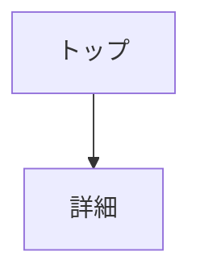

# CLAUDE.md

このファイルは Claude Code への指示書です。
プロジェクトで作業する際は、必ずこのファイルに従ってください。

---

## 1. プロジェクト概要

作業開始時に以下を確認：

| ファイル | 存在する場合 | 存在しない場合 |
|----------|-------------|---------------|
| docs/PRD.md | 内容を把握 | `/project:requirements` を促す |
| docs/DESIGN.md | 内容を把握 | `/project:design` を促す |
| docs/openapi.yaml | 内容を把握 | 必要に応じて作成 |
| src/ | 実装を継続 | 初回実装時に環境構築 |

---

## 2. 技術スタック

### 必須
| カテゴリ | 技術 |
|----------|------|
| フレームワーク | Next.js (App Router) 14.x |
| 言語 | TypeScript 5.x |
| スタイリング | Tailwind CSS 3.x |
| バリデーション | Zod |
| Linter / Formatter | ESLint / Prettier |
| パッケージ管理 | npm |
| Node.js | 20.x |
| 単体テスト | Vitest + React Testing Library |
| E2Eテスト | Playwright |
| コンポーネント管理 | Storybook |

### プロジェクトに応じて追加
| カテゴリ | 選択肢 |
|----------|--------|
| UIコンポーネント | shadcn/ui |
| アイコン | Lucide |
| フォーム | React Hook Form |
| データフェッチ | SWR / TanStack Query |

---

## 3. コマンド一覧

以下のスラッシュコマンドが使用可能です：

| コマンド | 説明 |
|----------|------|
| `/project:requirements` | 要件定義を行う |
| `/project:design` | 設計を行う |
| `/project:api` | API設計を行う |
| `/project:implement` | 実装を行う |
| `/project:continue` | 前回の続きから再開 |
| `/project:status` | 進捗状況を確認 |
| `/project:task` | 新しいタスクを作成 |

詳細は `.claude/commands/` 配下の各ファイルを参照。

---

## 4. 環境構築手順

`/project:implement` で src/ が存在しない場合に実行：

### 4.1 Next.js プロジェクト作成
```bash
npx create-next-app@latest . --typescript --tailwind --eslint --app --src-dir --import-alias "@/*"
```

### 4.2 追加パッケージのインストール
```bash
# Formatter
npm install -D prettier eslint-config-prettier

# バリデーション
npm install zod

# テスト
npm install -D vitest @testing-library/react @testing-library/jest-dom jsdom
npm install -D @playwright/test

# Storybook
npx storybook@latest init
```

### 4.3 設定ファイル作成
- .prettierrc
- .node-version（v20）
- vitest.config.ts
- playwright.config.ts

---

## 5. ディレクトリ構成

```
├── src/
│   ├── app/              # ページ（App Router）
│   ├── components/       # UIコンポーネント
│   │   └── ui/           # 汎用部品
│   │       └── Button/
│   │           ├── Button.tsx
│   │           ├── Button.test.tsx
│   │           └── Button.stories.tsx
│   ├── hooks/            # カスタムフック
│   ├── lib/              # ユーティリティ関数
│   ├── types/            # 型定義
│   └── styles/           # グローバルCSS
├── .storybook/           # Storybook 設定
└── docs/                 # ドキュメント
```

### コロケーションルール
- コンポーネント、テスト、stories は同じディレクトリに配置
- `ComponentName/` フォルダでグループ化

---

## 6. 命名規則

| 対象 | 規則 | 例 |
|------|------|-----|
| コンポーネント | PascalCase | `Button.tsx` |
| フック | camelCase + use | `useSettings.ts` |
| ユーティリティ | camelCase | `formatDate.ts` |
| 型定義 | PascalCase | `Settings.ts` |
| 定数 | UPPER_SNAKE_CASE | `API_BASE_URL` |

---

## 7. コーディング規約

### 基本ルール
- 関数コンポーネントを使用（クラスコンポーネント禁止）
- `any` 型は禁止、必ず型を定義する
- コンポーネントは1ファイル1コンポーネント
- named export を基本（default export は app/ 配下のみ）

### インポート順序
1. 外部ライブラリ（react, next など）
2. 内部モジュール（@/ エイリアス）
3. 相対パス
4. 型定義

### コーディングスタイル
- async/await を使用（.then チェーン禁止）
- 早期リターンでネストを減らす
- マジックナンバーは定数化
- コメントは「なぜ」を書く（「何」はコードで表現）

---

## 8. 禁止事項

- `any` 型の使用
- `console.log` の本番コード残留
- 未使用のインポート・変数
- `.then` チェーン（async/await を使う）
- クラスコンポーネント
- インラインスタイル（Tailwind を使う）
- default export（app/ 配下以外）
- PRD.md の無断変更（確認必須）
- テストなしでの複雑なロジック実装

---

## 9. ドキュメントテンプレート

### PRD.md テンプレート

```markdown
# プロジェクト名

## 1. 概要
<!-- 何を作るか（1-2文） -->

## 2. 背景・課題
<!-- なぜ作るのか -->

## 3. ターゲットユーザー
<!-- 誰のため？ -->

## 4. 機能一覧

### MVP（必須）
- [ ] 機能A
- [ ] 機能B

### 将来対応
- [ ] 機能C

## 5. 非機能要件
- 対応ブラウザ: Chrome, Safari, Edge 最新版
- レスポンシブ: 対応
```

### DESIGN.md テンプレート

```markdown
# 設計書

## 1. 技術スタック
<!-- 使用技術一覧 -->

## 2. ディレクトリ構成
<!-- フォルダ構造 -->

## 3. 状態管理
<!-- 状態管理の方針 -->

## 4. 主要コンポーネント
<!-- コンポーネント設計 -->

## 5. 外部連携
<!-- API、外部サービス -->
```

### SCREEN.md テンプレート

```markdown
# 画面設計

## 1. 画面一覧

| 画面名 | パス | 説明 |
|--------|------|------|
| トップ | / | xxx |

## 2. 画面遷移図



## 3. 各画面詳細

### トップ画面（/）
- 要素一覧
- 挙動
```

---

## 10. 参照ドキュメント

- [README](./README.md)
- [開発フロー](./docs/DEVELOPMENT_FLOW.md)
- [GitHub MCP 設定](./docs/SETUP_GITHUB_MCP.md)
