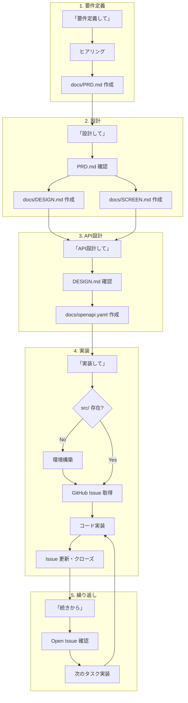

# Next.js バイブコーディング テンプレート

## 🎯 これは何？

Claude Code でバイブコーディングするためのプロジェクトテンプレートです。

AIに指示を出すだけで、要件定義から実装まで一貫したフォーマットで開発を進められます。

## 📦 テンプレートに含まれるもの
```
├── docs/           # ドキュメントテンプレート
├── .github/        # CI/CD 設定
├── CLAUDE.md       # AI向け指示書
└── README.md       # このファイル
```

※ `src/` はAIが初回実装時に自動生成します

## 🚀 はじめかた

1. このテンプレートから新規リポジトリを作成
2. clone して Claude Code で開く
3. AIに「要件定義して」と伝えて、作りたいものを決める
4. AIに「設計して」と伝えて、画面設計・全体設計を行う
5. AIに「API設計して」と伝えて、API設計を行う（必要に応じて）
6. AIに「実装して」と伝えて、開発スタート

## 🔄 開発フロー



## 💬 コマンド一覧

| やりたいこと | AIへの指示 | 結果 |
|-------------|-----------|------|
| 要件定義 | 「要件定義して」 | docs/PRD.md 作成 |
| 設計 | 「設計して」 | docs/DESIGN.md, SCREEN.md 作成 |
| API設計 | 「API設計して」 | docs/openapi.yaml 作成 |
| 実装開始 | 「実装して」 | 環境構築 + コード作成 |
| タスク作成 | 「〇〇のタスク作って」 | GitHub Issue 作成 |
| 進捗確認 | 「進捗教えて」 | Issue 一覧から現状サマリー |
| 作業再開 | 「続きから」 | 前回の状態を把握して再開 |

## 📄 ドキュメント構成

| ファイル | 内容 | 作成タイミング |
|----------|------|---------------|
| docs/PRD.md | 要件定義書 | 「要件定義して」 |
| docs/DESIGN.md | 設計書 | 「設計して」 |
| docs/SCREEN.md | 画面設計 | 「設計して」 |
| docs/openapi.yaml | API設計（OpenAPI 3.0） | 「API設計して」 |
| GitHub Issues | タスク・進捗管理 | 随時更新 |

### docs/PRD.md（要件定義書）
- プロジェクト概要・背景
- ターゲットユーザー
- 機能一覧（MVP / 将来）
- 非機能要件

### docs/DESIGN.md（設計書）
- 技術スタック
- ディレクトリ構成
- 状態管理方針
- 主要コンポーネント設計

### docs/SCREEN.md（画面設計）
- 画面一覧
- 画面遷移図
- 各画面のワイヤーフレーム・要素

### docs/openapi.yaml（API設計）
- OpenAPI 3.0 形式
- エンドポイント定義
- リクエスト / レスポンススキーマ
- Swagger UI で確認可能

### GitHub Issues（タスク・進捗管理）
- タスクの作成・管理
- 進捗の記録
- ラベルで分類（feature / bug / docs など）

## ⚙️ GitHub MCP 設定

このテンプレートは GitHub MCP を使ってタスク・進捗管理を行います。

[GitHub MCPの設定方法はこちら](docs/SETUP_GITHUB_MCP.md)

## 🛠 技術スタック
このテンプレートでは以下の技術スタックで実装します。

| カテゴリ | 技術 |
|----------|------|
| フレームワーク | Next.js (App Router) |
| 言語 | TypeScript |
| スタイリング | Tailwind CSS |
| Linter / Formatter | ESLint / Prettier |
| パッケージ管理 | pnpm |
| ホスティング | Vercel |
| CI/CD | GitHub Actions |

## 📝 ライセンス

MIT
