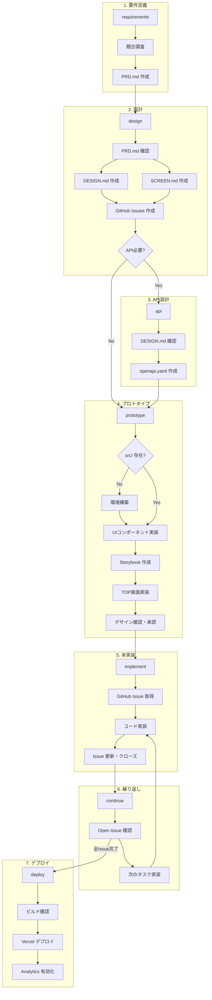

# 開発フロー

← [README に戻る](../README.md#workflow)

## フェーズ詳細

### 1. 要件定義
- **コマンド**: `/project:requirements`
- **処理内容**: INPUT.md 確認 → 競合調査 → PRD 作成
- **成果物**: reports/COMPETITIVE_ANALYSIS.md, docs/PRD.md

### 2. 設計
- **コマンド**: `/project:design`
- **処理内容**: PRD.md 確認 → 全体設計・画面設計 → タスク起票
- **成果物**: docs/DESIGN.md, docs/SCREEN.md, docs/COMPONENT.md, GitHub Issues

### 3. API設計（オプション）
- **コマンド**: `/project:api`
- **処理内容**: DESIGN.md 確認 → API定義
- **成果物**: docs/openapi.yaml
- **スキップ条件**: フロントエンドのみのアプリ（外部API/バックエンド不要）

### 4. プロトタイプ
- **コマンド**: `/project:prototype`
- **処理内容**:
  - src/ 無ければ環境構築（一時ディレクトリ経由で create-next-app）
  - 共通UIコンポーネント実装
  - Storybook で各コンポーネント確認
  - TOP画面のみ実装（ダミーデータ）
  - ユーザーにデザイン確認・承認を依頼
- **成果物**: src/components/, Storybook, TOP画面
- **完了条件**: デザインがユーザーに承認されること

### 5. 本実装
- **コマンド**: `/project:implement`
- **処理内容**:
  - プロトタイプ完了を確認
  - GitHub Issue からタスク取得
  - コード実装（承認済みコンポーネントを活用）
  - Storybook 追加（新規UIの場合）
  - lint / format 実行
  - テスト実行
  - Issue 更新・クローズ
- **成果物**: src/, Issue更新
- **前提条件**: `/project:prototype` が完了していること

### 6. 繰り返し
- **コマンド**: `/project:continue`
- **処理内容**: Open な Issue 確認 → 次のタスク実装

### 7. デプロイ
- **コマンド**: `/project:deploy`
- **処理内容**:
  - ビルド確認（npm run build）
  - 環境変数設定
  - Vercel へデプロイ（Vercel MCP 使用）
  - Analytics 有効化案内
  - 動作確認
- **成果物**: 本番環境 URL
- **前提条件**: Vercel MCP が設定されていること

## その他のコマンド

| コマンド | 説明 |
|----------|------|
| `/project:review` | コードレビューと修正 |

## 環境構築の注意

要件定義・設計後に実装を開始する場合、既存ファイル（docs/PRD.md 等）があるため `create-next-app` は直接実行できません。

環境構築時は一時ディレクトリを経由します（詳細は CLAUDE.md の「環境構築手順」を参照）。

---

← [README に戻る](../README.md#workflow)
