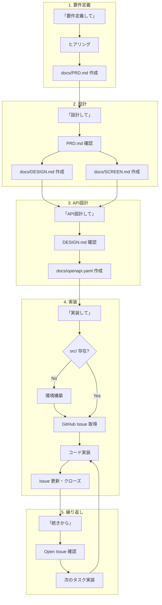

← [README に戻る](../README.md#-開発フロー)

# 開発フロー

## フェーズ詳細

### 1. 要件定義
- **コマンド**: 「要件定義して」
- **処理内容**: ヒアリング → 要件整理
- **成果物**: docs/PRD.md

### 2. 設計
- **コマンド**: 「設計して」
- **処理内容**: PRD.md 確認 → 全体設計・画面設計
- **成果物**: docs/DESIGN.md, docs/SCREEN.md

### 3. API設計
- **コマンド**: 「API設計して」
- **処理内容**: DESIGN.md 確認 → API定義
- **成果物**: docs/openapi.yaml

### 4. 実装
- **コマンド**: 「実装して」
- **処理内容**: 
  - src/ 無ければ環境構築（create-next-app）
  - GitHub Issue からタスク取得
  - コード実装
  - Issue 更新・クローズ
- **成果物**: src/, Issue更新

### 5. 繰り返し
- **コマンド**: 「続きから」
- **処理内容**: Open な Issue 確認 → 次のタスク実装
